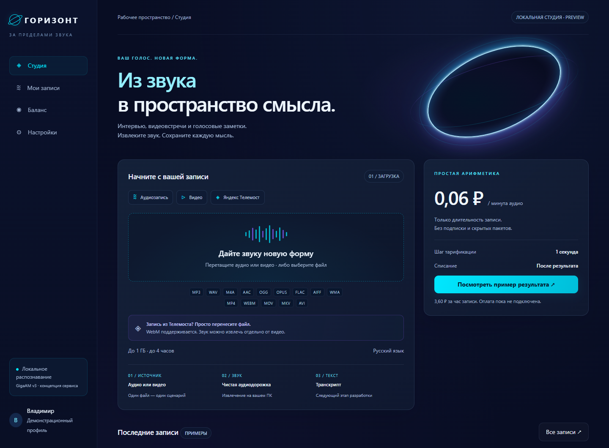

# TrnStudio · ГОРИЗОНТ

[](https://github.com/VRainD/TrnStudio/actions/workflows/ci.yml)


**Из звука — в пространство смысла.** Локальная студия аудио и видео с интерфейсом в цветах горизонта сингулярности. Подготовка записей для автономной транскрибации на NVIDIA GPU.



## Быстрый запуск

```bash
git clone https://github.com/VRainD/TrnStudio.git
cd TrnStudio
docker compose up -d --build
```

Откройте **http://127.0.0.1:4180**. Нужен Docker с Linux containers; на Windows — Docker Desktop/WSL2. FFmpeg и Node.js уже включены в образ. Для текущего извлечения звука GPU не требуется.

## Готовность

| Возможность | Статус |
|---|---|
| Адаптивный интерфейс, загрузка аудио и видео | Работает |
| Извлечение, прослушивание и скачивание WAV | Работает локально |
| Калькулятор 0,06 ₽/мин | Работает; списаний нет |
| Docker и перенос на другой компьютер | Конфигурация включена |
| Транскрипция GigaAM на GPU | Следующий этап |
| Авторизация, кошелёк, платежи и чеки | Спроектированы |
| Публичный многопользовательский сервис | Не готов к эксплуатации |

**Обработка выполняется на вашем компьютере.** Текущий сервер доступен только локально; это не готовый платёжный сервис. Текст в демонстрационном редакторе заранее подготовлен.

## Результат этого этапа

- [Полное продуктовое и техническое решение](docs/SPECIFICATION.md): модель, инфраструктура, авторизация, биллинг, безопасность, API и этапы реализации.
- [Локальная студия](prototype/index.html): обновлённый интерфейс аудио/видео, извлечение звука через FFmpeg, прослушивание и скачивание WAV, калькулятор стоимости, демонстрационный редактор и экспорт TXT.
- [План приёмки](docs/ACCEPTANCE.md): проверки перед запуском платного сервиса.

Реально работает локальное извлечение и преобразование аудио. Авторизация, платежи и распознавание ещё не реализованы. Файл передаётся только локальному серверу на этом компьютере; внешние сервисы не используются. Сервер разработки не предназначен для публикации в интернет.

## Просмотр

Выполните `node tools/preview.mjs` и откройте http://127.0.0.1:4173. Нужны Node.js, FFmpeg и FFprobe в PATH. Внешние библиотеки, шрифты и интернет не требуются. При открытии HTML напрямую доступен только макет, без извлечения.

Загрузите аудио или видео, нажмите «Извлечь звук из видео» / «Подготовить WAV», затем прослушайте или скачайте результат. Выход: WAV PCM 16-bit, 16 кГц, моно для распознавания речи. Это не архивная копия звука в исходном качестве.

Проверены синтетическими файлами: MP3, WAV, M4A, AAC, OGG, Opus, FLAC, AIFF, WMA; видео WebM, MP4, MOV, MKV, AVI. WebM с расширением `.webv` также распознаётся. Конкретный кодек должен поддерживаться сборкой FFmpeg. Реальную запись Телемоста ещё нужно проверить. Файлы с несколькими аудиодорожками пока отклоняются с пояснением.

Ограничения локальной версии: один файл одновременно, до 1 ГБ/4 часов, обработка не более 5 минут; временные данные удаляются после передачи результата. После аварийного завершения процесса остатки могут сохраниться в `.local-media/`. Для публичного сервиса нужны предусмотренные спецификацией изоляция декодера, авторизация, фоновая очередь и уборщик.

Проверка медиасценариев: `node tools/test-media.mjs`. Тестовые файлы сохраняются в игнорируемой папке `.qa/`.

## Принятые решения

Тариф: **0,06 ₽ за минуту**, 3,60 ₽ за час; итог за запись округляется вверх до копейки. Палитра интерфейса адаптирована по anisimovvp.pro и anisimovvp.com: глубокий синий, циан и фиолетовый горизонт.

## Docker и перенос

`docker compose up -d --build` запускает студию на http://127.0.0.1:4180. В образ включены Node.js, FFmpeg и FFprobe; установка их на целевом хосте не нужна. [Инструкция переноса](docs/DEPLOYMENT.md) описывает Windows/WSL2, офлайн-перенос через `docker save/load`, проверку GPU, журналы и ограничения текущей версии.

Профиль `gpu-check` только показывает `nvidia-smi`. Профиль **`gpu-probe`** поднимает минимальный контейнер с pinned CUDA/PyTorch/GigaAM и замеряет VRAM/RTF (целевая карта приёмки — **RTX 2060**, типично **6 ГБ** VRAM). UI Горизонта при этом не меняется. Подробности: [docs/GPU_PROBE.md](docs/GPU_PROBE.md).

```bash
docker compose --profile gpu-check run --rm gpu-check
docker compose --profile gpu-probe build gpu-probe
docker compose --profile gpu-probe run --rm gpu-probe
```

## Целевая архитектура

GigaAM v3 e2e RNNT → Python/FastAPI → PostgreSQL → один GPU worker → React/TypeScript → Docker Compose на Windows 11/WSL2. Для публичного запуска — отдельный HTTPS шлюз и исходящее VPN-соединение с вычислительной машиной. ЮKassa — предполагаемый платёжный провайдер. У владельца уже есть электронная касса: используем её для фискализации через отдельный адаптер, конкретный способ подключения уточняется по модели/сервису. Покупка новой кассы в базовый план не входит.

Целевой бюджет VRAM — **~6 ГБ на RTX 2060** (Super часто 8 ГБ); необходим реальный замер через `gpu-probe`. Запас тесный для GigaAM RNNT относительно прежних 16 ГБ. Цифры с 3060 Ti / 4090 Laptop не использовать как эталон приёмки.

## Документация

- [Архитектура, продукт, авторизация и биллинг](docs/SPECIFICATION.md)
- [Docker, Windows/WSL2 и офлайн-перенос](docs/DEPLOYMENT.md)
- [GPU-пробник GigaAM (RTX 2060)](docs/GPU_PROBE.md)
- [Критерии приёмки перед публичным запуском](docs/ACCEPTANCE.md)
- [История изменений](CHANGELOG.md)
- [Работа над проектом](CONTRIBUTING.md)

## Дорожная карта

- [x] Интерфейс и локальная обработка медиа.
- [x] Тариф и контейнерная упаковка.
- [ ] GPU-пробник GigaAM и замеры VRAM/RTF на RTX 2060 (~6 ГБ) (профиль `gpu-probe` в репозитории).
- [ ] Очередь, хранение результатов и редактор транскриптов.
- [ ] Учётные записи и изоляция данных пользователей.
- [ ] Эквайринг и интеграция существующей кассы.
- [ ] Публичная бета с мониторингом и резервным копированием.

Зависимости имеют собственные лицензии; лицензия на код приложения пока не объявлена.
