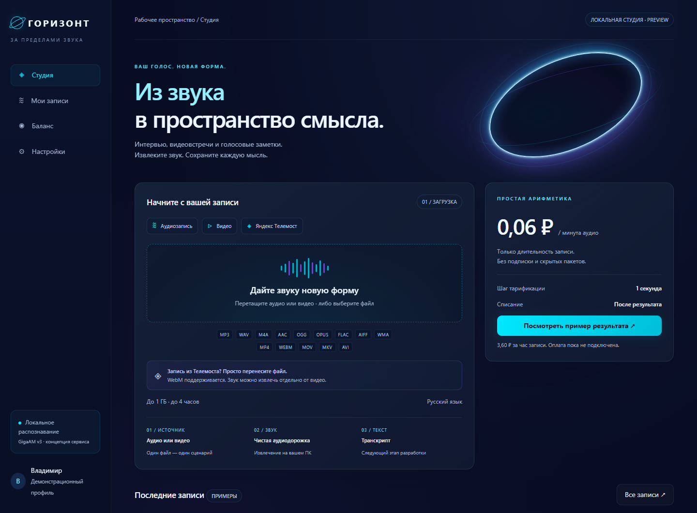

# TrnStudio · ГОРИЗОНТ

[](https://github.com/VRainD/TrnStudio/actions/workflows/ci.yml)


**Из звука — в пространство смысла.** Локальная студия аудио и видео с интерфейсом в цветах горизонта сингулярности. Подготовка записей для автономной транскрибации на NVIDIA GPU.



## Быстрый запуск

```bash
git clone https://github.com/VRainD/TrnStudio.git
cd TrnStudio
docker compose up -d --build
```

Откройте **http://127.0.0.1:4180**. Поднимаются **ClickHouse** (транскрипты) и студия. Зарегистрируйте аккаунт (или включите `AUTH_DEMO_SEED=true`). Нужен Docker с Linux containers; на Windows — Docker Desktop/WSL2.

## Готовность

| Возможность | Статус |
|---|---|
| Адаптивный интерфейс, загрузка аудио и видео | Работает |
| Регистрация / вход / выход (HttpOnly session) | Работает |
| «Мои записи» + изоляция по `user_id` | Работает (ClickHouse) |
| Long-form транскрибация → сохранение в ClickHouse | Работает (mock в CI) |
| Калькулятор 0,06 ₽/мин (= ток./мин) | Серверный quote + UI; списания при `BILLING_ENABLED=true` |
| Docker Compose (studio + ClickHouse) | Конфигурация включена |
| Кошелёк, holds, промокоды (файловый ledger) | Работает; привязка к реальному `user_id` |
| Админ-панель (health, jobs, users/credit, promos, audit) | Работает (`role===admin`) |
| Онлайн-платежи ЮMoney/ЮKassa, email verify, 2FA | Stub / не подключены без секретов |
| Публичный многопользовательский сервис | Не готов к эксплуатации |

**Обработка выполняется на вашем компьютере.** Текущий сервер доступен только локально.

## Результат этого этапа

- [Полное продуктовое и техническое решение](docs/SPECIFICATION.md): модель, инфраструктура, авторизация, биллинг, безопасность, API и этапы реализации.
- [Локальная студия](prototype/index.html): вход/регистрация, кабинет «Мои записи», long-form ASR, баланс токенов.
- [План приёмки](docs/ACCEPTANCE.md): проверки перед запуском платного сервиса.

## Просмотр без Docker (нужен ClickHouse)

```bash
docker compose up -d clickhouse
CLICKHOUSE_URL=http://127.0.0.1:8123 node tools/clickhouse/migrate.mjs
CLICKHOUSE_URL=http://127.0.0.1:8123 node tools/preview.mjs
```

Откройте http://127.0.0.1:4173. Нужны Node.js ≥22, FFmpeg и FFprobe в PATH.

Проверка: `npm test` (включая auth + ClickHouse). Браузер: `npm run test:ui` при запущенной студии.

## Принятые решения

Тариф: **0,06 ток./мин** (= 0,06 ₽/мин, **1 токен = 1 ₽**); 3,60 ток. за час; итог округляется вверх до 0,01 ток. Палитра интерфейса адаптирована по anisimovvp.pro и anisimovvp.com: глубокий синий, циан и фиолетовый горизонт. Онлайн-оплата: предпочтительно `PAYMENT_DRIVER=yoomoney` (+ касса фаза D); см. [docs/PAYMENTS.md](docs/PAYMENTS.md). Транскрипты — **ClickHouse**; сессии/кошелёк — тонкое файловое хранилище приложения.

## Docker и перенос

`docker compose up -d --build` запускает ClickHouse + студию на http://127.0.0.1:4180. [Инструкция переноса](docs/DEPLOYMENT.md).

Профиль `gpu-check` только показывает `nvidia-smi`. Профиль **`gpu-probe`** поднимает минимальный контейнер с pinned CUDA/PyTorch/GigaAM. Подробности: [docs/GPU_PROBE.md](docs/GPU_PROBE.md).

```bash
docker compose --profile gpu-check run --rm gpu-check
docker compose --profile gpu-probe build gpu-probe
docker compose --profile gpu-probe run --rm gpu-probe
```

## Целевая архитектура

GigaAM v3 e2e RNNT → Node studio preview → ClickHouse (транскрипты) + тонкий app DB (сессии/кошелёк) → GPU worker → Docker Compose. Для публичного запуска — HTTPS шлюз. ЮMoney — предпочтительный платёжный путь (+ касса).

## Документация

- [Архитектура, продукт, авторизация и биллинг](docs/SPECIFICATION.md)
- [Платежи stub / ЮKassa / ЮMoney](docs/PAYMENTS.md)
- [Docker, Windows/WSL2 и офлайн-перенос](docs/DEPLOYMENT.md)
- [GPU-пробник GigaAM (3060 Ti 16 ГБ)](docs/GPU_PROBE.md)
- [Критерии приёмки перед публичным запуском](docs/ACCEPTANCE.md)
- [История изменений](CHANGELOG.md)
- [Работа над проектом](CONTRIBUTING.md)

## Дорожная карта

- [x] Интерфейс и локальная обработка медиа.
- [x] Тариф и контейнерная упаковка.
- [x] Учётные записи, сессии и изоляция данных пользователей.
- [x] Хранение транскриптов в ClickHouse + кабинет «Мои записи».
- [x] Админ-панель UI (обзор, задачи, пользователи/credit, промо, аудит).
- [ ] GPU-пробник GigaAM и замеры VRAM/RTF на RTX 3060 Ti 16 ГБ (профиль `gpu-probe` в репозитории).
- [ ] Email verify / reset / 2FA admin (SPEC §4).
- [ ] Эквайринг и интеграция существующей кассы.
- [ ] Публичная бета с мониторингом и резервным копированием.

Зависимости имеют собственные лицензии; лицензия на код приложения пока не объявлена.
