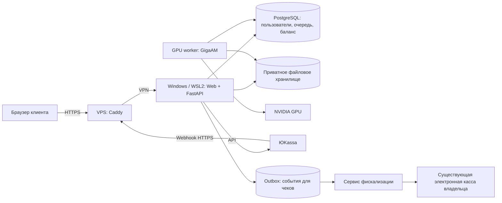

# ГОРИЗОНТ: продуктовое и техническое решение

Статус: спецификация для реализации, а не описание уже работающего сервиса.

## 1. Продукт и границы автономности

Русскоязычный сервис: загрузить запись, заранее увидеть цену, получить редактируемый текст и субтитры. Рабочее название — «Горизонт», визуальная идея — свет вокруг горизонта событий.

Распознавание выполняется только на собственной GPU. После первоначального скачивания и проверки всех весов вычислительный узел должен работать без доступа к внешним моделям. Интернет нужен для доступа клиентов, отправки почты и оплаты. Полностью изолированная установка допускает локальные учётные записи и административное начисление баланса, но не онлайн-эквайринг.

Первый релиз: русский язык, загрузка MP3/WAV/M4A/AAC/OGG/Opus/FLAC/AIFF/WMA и видео MP4/WebM/MOV/MKV/AVI/M4V, предварительная оценка, очередь, транскрипт, редактор, TXT/SRT/VTT, история, баланс, платежи, личные настройки и административная панель. Видео принимается ради аудиодорожки; пользователь может отдельно скачать подготовленный WAV. Максимум первоначально: 1 ГБ и 4 часа на файл; ограничения конфигурируемые.

Телемост сохраняет записи в WebM согласно официальной документации Яндекса. Упомянутое пользователем расширение `.webv` допускается на входе как кандидат для проверки, но не объявляется отдельным кодеком или гарантированно поддержанным контейнером. FFprobe определяет фактический формат по содержимому. WebVTT (`.vtt`) — текст субтитров и не заменяет аудиозапись.

Медиасценарий: выбор файла → проверка контейнера и звуковых потоков → выбор аудиодорожки (если несколько) → извлечение → серверная длительность/цена → подтверждение распознавания. При отсутствии звука сообщить об этом до оплаты. При неопределённой длительности WebM считать длительность по декодированным семплам, а не доверять браузеру. По умолчанию результат для GigaAM — PCM WAV 16 кГц/моно; исходник не изменяется. Не позиционировать этот WAV как сохранение исходного качества. Базовое извлечение в локальной версии бесплатно, платная транскрибация — отдельное действие.

Реализован локальный пробник `tools/preview.mjs` + `tools/media.mjs`: потоковый приём одного файла, FFprobe, FFmpeg, выдача WAV, обработка ошибок и удаление временных данных. Несколько звуковых потоков в пробнике отклоняются; выбор дорожки остаётся задачей полноценного backend. Поддержка конкретного контейнера зависит от кодека и сборки FFmpeg. Проверены синтетические примеры; реальная запись Телемоста в тестах пока отсутствует.

После проверки основного сценария: разделение говорящих, DOCX, словари терминов, рабочие пространства и API. Резюме встречи и чат по записи потребуют отдельной модели; в первый релиз не включать и память GPU под них не расходовать. Не обещать распознавание говорящих средствами одной GigaAM.

## 2. Модель и обработка

Базовый кандидат — `v3_e2e_rnnt`; для сравнительного замера — `v3_e2e_ctc`. В официальном проекте обе версии поддерживают пунктуацию и нормализацию; актуальные модели публикуются под MIT. Сохранить точную ревизию кода, лицензии весов и зависимостей в SBOM. Не устанавливать случайный старый пакет только по совпадению имени.

Официальный короткий `transcribe` ограничен 25 секундами. Поэтому целую запись нельзя подавать одним вызовом. Длинная обработка должна использовать VAD и сегменты не длиннее лимита. Штатный longform имеет дополнительные зависимости pyannote и условия доступа к весам: пройти их при подготовке, закэшировать все ресурсы и доказать работу без сети. Альтернативный локальный VAD — отдельный адаптер после сравнительного теста.

Поток обработки:

1. Потоковая загрузка в карантин, проверка размера, владельца и лимитов.
2. FFprobe и декодирование FFmpeg в изолированном CPU процессе с лимитами времени, памяти и размера выхода. Внешние URL и сетевые протоколы запрещены.
3. Длительность считать сервером по декодированному аудио; использовать число семплов и частоту. Значения из браузера — только предварительные.
4. Показать длительность, тариф и итоговую цену. Пользователь подтверждает её до постановки в GPU очередь.
5. Привести звук к 16 kHz; способ сведения каналов фиксировать. Стереозапись оплачивается по длительности, без удвоения.
6. VAD, сегментация, распознавание, сборка с исходными временными смещениями. Не склеивать границы так, чтобы терялись или дублировались слова; длинную непрерывную речь делить с контролируемым перекрытием.
7. Сохранить версионированный JSON результата, затем атомарно завершить задание и списать резерв.

Временные метки сегментов доступны из разбиения; точность слов и субтитров проверить отдельно. Не выдавать границы чанков за точное выравнивание слов. При отсутствии речи вернуть понятный результат и снять резерв без списания.

Один долгоживущий процесс держит одну модель в VRAM. Начальная параллельность GPU = 1, batch = 1, FP16 только после проверки качества и поддержки. CPU подготовка может идти отдельно с ограничением конкурентности. На CUDA OOM уменьшить сегмент и повторить один раз; затем корректно завершить с ошибкой без оплаты. Не загружать модель в каждый HTTP процесс.

16 ГБ — проектный бюджет, не подтверждённый расход. На целевой карте (**RTX 3060 Ti 16 ГБ**) замерить VRAM, real-time factor, задержку первого сегмента и температуру через профиль Compose `gpu-probe` (`docs/GPU_PROBE.md`). Замеры с RTX 4090 Laptop 16 ГБ нельзя считать замерами 3060 Ti. Стартовая конфигурация хоста: 32 ГБ RAM и SSD с 100 ГБ свободного места как рабочий ориентир, далее уточнить по нагрузке.

## 3. Развёртывание

Windows 11 → WSL2 → Linux containers в Docker Desktop → NVIDIA GPU. Windows сохраняем. Для постоянного круглосуточного сервиса позже можно перенести тот же Compose на Linux, не переписывая приложение.

Для небольшой установки очередь размещаем в PostgreSQL, без обязательных Redis и Celery: `FOR UPDATE SKIP LOCKED`, lease и heartbeat. Это уменьшает число сервисов и позволяет резервировать деньги и создавать задание в одной транзакции.

Контейнеры: edge/Caddy на VPS; web, api, worker, PostgreSQL и периодический maintenance на GPU хосте. Изначально хранение файлов — приватный Docker volume через API, с интерфейсом для будущего S3. Браузер не получает пути файловой системы. База и файлы размещаются в Linux volume, не в Windows bind mount на рабочем диске.

VPS служит публичным входом с доменом и TLS; GPU хост устанавливает исходящий WireGuard туннель. Это работает при отсутствии входящего публичного IP у Windows. Между VPS и GPU разрешён только порт приложения. PostgreSQL, Docker socket, административные инструменты и GPU worker в интернет не выставлять. Загрузки идут потоково, без буферизации гигабайт в RAM шлюза.

Распознавание и файлы остаются на вычислительной машине, однако аудио проходит через HTTPS шлюз: это нужно честно отразить в политике обработки. Регион VPS и резервных копий выбирается под требования владельца сервиса. Оплату и правовые документы финализировать с данными оператора до продаж.

Windows: отключить сон для серверного режима, настроить восстановление после перезапуска, проверить запуск Docker/WSL без ручных действий. После обновлений выполнять smoke test. При недоступности GPU очередь показывает паузу, новые резервы не создаются, клиенту не обещается недостоверное время завершения.

Секреты — вне Git, отдельные секреты БД, почты и платежей; контейнеры с непривилегированным пользователем, read-only rootfs где возможно. Только worker получает GPU. Версии образов, CUDA/PyTorch и ревизия GigaAM фиксируются после совместимого теста; не использовать `latest` в production.

## 4. Авторизация

Email и пароль; подтверждение email перед платной обработкой. Пароль хранится как Argon2id hash с солью. Начальная политика: минимум 12 символов, поддержка менеджеров паролей и вставки. Не обрезать пароль незаметно.

Серверные сессии с криптографически случайным opaque token; в БД хранится hash токена. Cookie: HttpOnly, Secure, SameSite=Lax; CSRF token и проверка Origin на изменяющих запросах. JWT в localStorage не использовать. Ротация сессии при входе и повышении привилегий. Обычная сессия: до 7 дней бездействия и 30 дней абсолютного срока; у администратора короче.

Подтверждение почты и сброс пароля — одноразовые токены с hash в БД и сроком действия, например 24 часа и 30 минут соответственно. Ответ о сбросе одинаковый для существующего и неизвестного адреса. Смена пароля отзывает остальные сессии. Страница «Устройства» позволяет выйти из всех сессий.

Лимиты по IP и аккаунту на вход, регистрацию, сброс и загрузку; дополнительные задержки при переборе. Для администратора обязательна TOTP 2FA и recovery codes. Пользовательские файлы и результаты доступны только владельцу; проверка на каждом API запросе, а не только в интерфейсе.

Роли: пользователь, оператор поддержки, администратор. Поддержка видит метаданные задания и платежа, но не аудио и текст по умолчанию. Доступ к содержимому — отдельное ограниченное разрешение пользователя с журналированием. Любое ручное изменение баланса требует причины и записи в аудит.

## 5. Биллинг

Предоплаченный баланс в рублях; тариф по решению владельца **0,06 ₽ за минуту** (6 коп./мин, 3,60 ₽/час). Пополнения 100/300/1000 ₽, без подписки и автосписаний. Платёжные реквизиты остаются у эквайера.

Оплата за всю длительность записи, включая паузы. Посекундная тарификация, округление итоговой суммы вверх до копейки. Формула для количества семплов N, sample rate S и тарифа R в копейках за минуту:

`cost_kopecks = ceil(N * R / (S * 60))`

В расчётах целые числа, не float. Например, 17:42 при 0,06 ₽/мин = 1,07 ₽; 61 сек = 0,07 ₽; 1 сек = 0,01 ₽; 60 минут = 3,60 ₽. Тариф и версия формулы фиксируются в quote и задании; смена тарифов не меняет уже подтверждённую цену. Quote действует 30 минут.

Экономику проверять формулой: выручка за аудиочас минус комиссия, инфраструктура, энергия, амортизация, поддержка и возвраты. Тариф 0,06 ₽/мин задан владельцем. Производительность и себестоимость измерить отдельно; цена не является обещанием рентабельности.

Доступный баланс = учётный баланс − активные резервы. Резерв не является окончательным списанием. Пополнение зачисляется только после проверки успешного платежа на сервере. Процесс:

1. API блокирует строку кошелька, проверяет владельца quote, срок, неизменность файла и доступный остаток.
2. В одной транзакции создаёт резерв, задание и событие аудита; повтор с тем же idempotency key возвращает прежнее задание.
3. Worker сохраняет результат в staging и проверяет его целостность. В транзакции публикует ссылку на результат, переводит задание в succeeded, создаёт единственное списание и закрывает резерв.
4. При окончательной ошибке или отмене резерв освобождается один раз. При падении между записью файла и транзакцией staging удаляется уборщиком или используется при восстановлении.

Денежный журнал неизменяемый: credit, debit, refund, adjustment; резервы — отдельная таблица. У каждой операции уникальный business key. Для MVP достаточно журнала кошелька с транзакционными инвариантами; это не замена бухгалтерскому учёту. Ежедневная сверка платежей, возвратов, резервов и баланса.

ЮKassa: создать платёж с серверной суммой, валютой RUB и уникальным Idempotence-Key; сохранить provider payment ID. На webhook повторно запросить состояние платежа у провайдера, сверить магазин, сумму, валюту и внутренний заказ. Redirect пользователя не доказывает оплату. Дубликаты webhook и изменение порядка доставки не должны повторно зачислять деньги. Если провайдер недоступен — статус pending и последующая сверка. Возврат через провайдера тоже идемпотентен; доступную сумму удержать до завершения возврата, учитывать частичные возвраты.

Чеки и схема предоплаты/зачёта, оферта, обработка персональных данных и правила возврата — отдельные обязательные задачи перед приёмом реальных платежей. Конкретная схема зависит от оператора сервиса и должна быть проверена перед запуском; тестовый магазин не заменяет её.

### Существующая электронная касса

Владелец сообщил о существующей электронной кассе и назвал сервис «Юмани». Пока не установлено, имеется ли в виду кошелёк ЮMoney, магазин ЮKassa, сервис «Чеки от ЮKassa» или подключённая через него сторонняя касса. Сохраняем существующее решение после уточнения; новую кассу и сервис «Чеки от ЮKassa» автоматически не подключаем. Доступный API, ОФД и действующая схема подключения пока неизвестны. Название «Юмани» само по себе не подтверждает наличие фискальной кассы или возможность автоматизации интернет-продаж.

Разделяем `PaymentProvider` (приём и возврат денег), `WalletService` (баланс и резерв) и `FiscalProvider` (чеки). ЮKassa остаётся кандидатом для эквайринга; окончательный выбор учитывает существующий договор владельца. У фискального адаптера операции submitReceipt, getReceiptStatus и reconcile; тип операции и обязательные реквизиты задаются утверждённой схемой расчётов.

Два возможных способа: штатная интеграция эквайера с имеющейся кассой либо прямое подключение приложения к API кассового сервиса. Выбирается один ответственный маршрут для каждой фискальной операции: нельзя одновременно отправлять один чек через оба канала. При локальном драйвере кассы потребуется отдельный Windows bridge; его не помещать в Linux GPU контейнер. Bridge должен работать без открытого публичного порта, с аутентификацией и журналом запросов.

Для балансовой схемы предусмотреть события поступления аванса, оказания услуги с зачётом ранее внесённых средств и возврата. Резерв средств не является оплатой или оказанием услуги и сам по себе не порождает чек. Точные признаки расчёта, предмет расчёта, НДС, система налогообложения и сроки передачи определяются данными оператора и проверяются при интеграции; не зашивать их догадками. Чек зачёта не означает повторное списание с карты. Для пополнений, использованных в нескольких заданиях, хранить распределение средств по операциям, включая частичные возвраты.

Событие для чека записывать в transactional outbox в одной транзакции с соответствующей денежной/сервисной операцией. Фискальный worker обрабатывает его отдельно от GPU. Таблицы `fiscal_receipts`, `fiscal_attempts`, `outbox_events` хранят business key, связь с платежом/заданием/возвратом, вид чека, неизменяемый снимок реквизитов, provider ID, состояние и ссылку на чек. Статусы: pending, submitted, succeeded, retryable_error, manual_review. Фискальные номера и признаки сохранять только из подтверждённого ответа кассы.

При тайм-ауте сначала запросить состояние по внешнему ID, а не отправлять новый чек вслепую. Повторы используют один business key; если провайдер не поддерживает надёжную идемпотентность/поиск, неопределённый исход переводится в ручную проверку. Повторный webhook не создаёт чек или зачисление заново. Сбой кассы не отменяет уже подтверждённый банком факт оплаты; состояние оплаты и состояние чека показываются раздельно. Немедленный сигнал оператору, контролируемые повторы и ограничение новых оплат при сбоях должны учитывать применимые сроки, а не откладывать фискализацию бессрочно.

В кабинете добавить «Платежи и чеки»: связанные документы по каждому пополнению, услуге и возврату, а также email получения чека. В админке — очередь фискализации, ошибки, состояние кассы и сверка. На чеке использовать понятное наименование услуги, длительность/цену по утверждённой товарной позиции; не передавать имя аудиофайла и содержание записи.

До реализации адаптера нужны название сервиса или модель кассы и способ подключения. Затем проверить поддержку автоматических интернет-расчётов, тестового режима, чеков зачёта/возврата, текущего формата фискальных данных и необходимых реквизитов. Секреты кассы получать через защищённую конфигурацию, а не сохранять в документах проекта.

## 6. Очередь и устойчивость

Состояния: uploaded → probing → awaiting_confirmation → queued → processing → succeeded. Дополнительные: rejected, failed, canceled, cancel_requested. Файл с ошибкой формата не доходит до резерва. Ошибка сети при загрузке допускает повтор без дубля задания.

Глобально один worker на GPU; не более двух активных заданий пользователя, остальные допускаются в ожидание в пределах квоты. Планирование round-robin между пользователями, внутри пользователя FIFO. Длинные записи сохраняют сегментные checkpoints; при росте нагрузки можно отдавать GPU по квантам сегментов без потери прогресса.

Lease с heartbeat, например heartbeat 10 сек / lease 90 сек, с fencing token на каждую попытку. Старый worker не может опубликовать результат после перевыдачи задания. Просроченные leases подхватывает reconciler. Не более двух повторов для временных ошибок; неверные файлы не повторять. Прогресс — по обработанной длительности, ETA только после накопления реальных измерений.

Отмена в очереди освобождает резерв. Во время обработки отмена проверяется между сегментами; победитель гонки cancel/success определяется транзакцией. Если success уже зафиксирован, результат оплачен, повторный cancel ничего не меняет. Правило показывается до запуска.

## 7. Интерфейс

Цвета по ориентирам anisimovvp.pro и anisimovvp.com: глубокий синий фон #080d23, поверхности #101a35, основной текст #edf6ff, вторичный #a4b7d5, циан #00e8ff / #00d4ff и фиолетовый #8b5cff. Световое кольцо — декоративный фон верхней части кабинета, не под редактором. Крупная спокойная типографика, сетка 8 px, тонкие границы, контрастные фокусные состояния. Движение учитывать через prefers-reduced-motion.

Экраны:

| Экран | Содержание и действия |
|---|---|
| Публичная страница | Обещание локальной обработки, тариф, пример результата, ограничения, вход |
| Вход и регистрация | Email, пароль, подтверждение, восстановление, понятные ошибки |
| Студия | Загрузка, длительность, цена, подтверждение, очередь, недавние записи |
| Запись | Плеер, таймкоды, редактирование, поиск, экспорт, удаление |
| Баланс | Доступно / зарезервировано, пополнение, история, статусы и чеки |
| Настройки | Профиль, пароль, устройства, срок хранения, удаление аккаунта |
| Администрирование | Очередь, GPU, ошибки, платежи, тарифы, аудит, режим обслуживания |

Обязательны состояния пусто/загрузка/недостаточно средств/ошибка файла/нет речи/узел недоступен/повтор/успех. Не показывать выдуманный процент точности. На мобильном — сворачиваемая навигация и одна колонка. Клавиатурная навигация, подписи полей, aria-live для событий, минимум WCAG AA для значимых элементов.

Интерактивный прототип показывает визуальную систему, локальное извлечение и скачивание аудио, расчёт по длительности и демонстрационный редактор. Все данные примера отмечены, платёж и реальная транскрибация отсутствуют. Извлечение доступно при запуске локального сервера; при открытии HTML напрямую оно отключено.

## 8. Данные и API

Таблицы: users, sessions, one_time_tokens, wallets, ledger_entries, holds, payments, refunds, uploads, quotes, jobs, job_segments, transcript_versions, audit_events, worker_heartbeats. ID — UUID, created_at/updated_at в UTC. Email нормализовать последовательно; не удалять точки и plus-суффиксы произвольно.

Ключевые ограничения: unique(provider, provider_payment_id), unique(ledger business_key), один резерв и одно списание на job, неотрицательный доступный баланс при подтверждении, owner_id во всех пользовательских сущностях, уникальные job/segment/version. Финансовые суммы — bigint копейки, цены и длительности снимком в quote. Для истории тарифа отдельная versioned конфигурация.

| Метод и путь | Назначение |
|---|---|
| POST /auth/register, /login, /logout | Учётная запись и сессии |
| POST /auth/verify, /forgot-password, /reset-password | Одноразовые токены |
| GET /me, /sessions | Профиль и устройства |
| POST /uploads | Загрузка с квотой и idempotency key |
| GET /uploads/:id/quote | Серверная цена после проверки |
| POST /jobs | Подтверждение quote и резерв |
| GET /jobs, /jobs/:id | История и состояние |
| GET /jobs/:id/events | SSE прогресс с повторным подключением |
| POST /jobs/:id/cancel | Отмена по правилам состояний |
| PATCH /jobs/:id/transcript | Версионированное редактирование с If-Match |
| GET /jobs/:id/export?format=txt | Экспорт только владельцу |
| DELETE /jobs/:id | Удаление содержимого, финансовый журнал сохраняется по политике |
| GET /wallet, /wallet/transactions | Баланс и журнал |
| POST /payments | Создание пополнения |
| POST /webhooks/yookassa | Проверка платежа и идемпотентное зачисление |
| GET /admin/health, /admin/jobs | Защищённая диагностика |

Файлы с непредсказуемыми именами вне web-root; скачивание через авторизованный API. Путь клиента не используется как путь хранения. Расширение не заменяет проверку содержимого. Не поддерживать загрузку по произвольной ссылке в MVP.

## 9. Хранение и эксплуатация

Предлагаемый срок: исходное аудио 7 дней после завершения, текст 30 дней; пользователь видит срок и может удалить раньше. Промежуточный PCM — удалить после успеха или окончательной ошибки. Финансовые записи имеют отдельную утверждённую политику хранения. Удаление аккаунта сначала отменяет активные задачи и запускает управляемую очистку.

Считать объём PCM: mono 16 kHz/16-bit ≈ 115,2 МБ на час; одновременно хранятся оригинал и временные данные. При свободном месте ниже порога, например 15 ГБ, приостановить приём, а не доводить PostgreSQL до заполнения диска.

Ежедневные шифрованные резервные копии PostgreSQL, конфигурации и нужных результатов вне основного диска. Цели MVP: RPO 24 часа, RTO 4 часа, подтвердить восстановлением. Политика удаления должна учитывать срок истечения backups. Весам модели достаточно проверенного артефакта с checksum.

Метрики: GPU VRAM/температура, длина и возраст очереди, heartbeat, RTF, ошибка декодирования, процент падений, место на диске, платежи pending, зависшие резервы. Логи без текста аудио, паролей, токенов и платёжных секретов. Корреляция по request_id/job_id. Алерты при падении worker, росте очереди и неудачной сверке.

## 10. Этапы реализации

1. Технический пробник: контейнер с CUDA, закреплённая GigaAM, 20–30 записей разной длины, замер качества/VRAM/скорости и тест без сети. Это критерий выбора e2e RNNT или CTC.
2. Вертикальный локальный сценарий: загрузка → probe → очередь → GPU → редактор → экспорт. Без платежей. Доказать восстановление после остановки контейнера.
3. Аккаунты и приватность: сессии, подтверждение email, reset, права, удаление, лимиты.
4. Кошелёк, тестовый эквайринг и адаптер существующей кассы: резервы, журнал, webhooks, отмена, возвраты, чеки, outbox и сверка. Пройти конкурентные тесты; исключить двойную фискализацию.
5. Публичная бета: домен/TLS/VPN, backup/restore, мониторинг, нагрузочные и изоляционные тесты, подтверждение экономики и документов.
6. Реальные платежи только после закрытия критериев приёмки. Затем диаризация и дополнительные форматы по данным пользователей.

Для публикации позже потребуются домен, доступ к выбранному VPS, SMTP и данные магазина. Для этого этапа они не нужны. Срок реализации оценивать после GPU пробника: интеграция модели и платежей важнее календарного обещания.

## Источники проверенных внешних фактов

- GigaAM, модели, лицензия и ограничения inference: https://github.com/salute-developers/GigaAM
- Карточка весов: https://huggingface.co/ai-sage/GigaAM-v3
- Формат записи Телемоста: https://yandex.ru/support/yandex-360/customers/telemost/web/ru/recording
- Проверка потоков FFprobe: https://ffmpeg.org/ffprobe.html
- Docker GPU на Windows/WSL2: https://docs.docker.com/desktop/features/gpu/
- ЮKassa API: https://yookassa.ru/developers/api
- Уведомления: https://yookassa.ru/developers/using-api/webhooks
- Идемпотентность: https://yookassa.ru/developers/using-api/interaction-format
- Работа с уже существующей кассой: https://yookassa.ru/docs/support/merchant/payments/implement/online-sales-register
- Чеки и зачёт предоплаты через стороннюю кассу: https://yookassa.ru/developers/payment-acceptance/receipts/54fz/other-services/payments

Все остальные параметры, тарифы и архитектурные решения выше — предложения проекта; их готовность не подразумевается.
